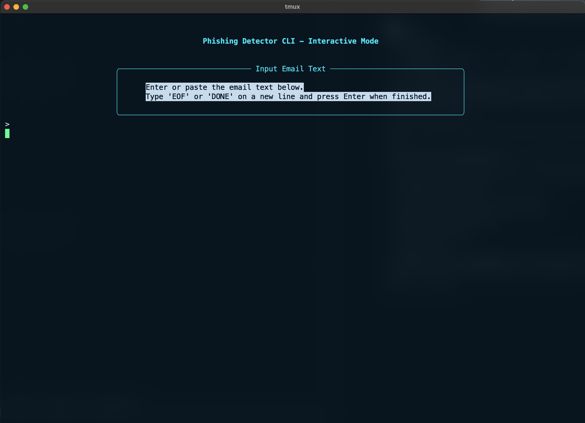
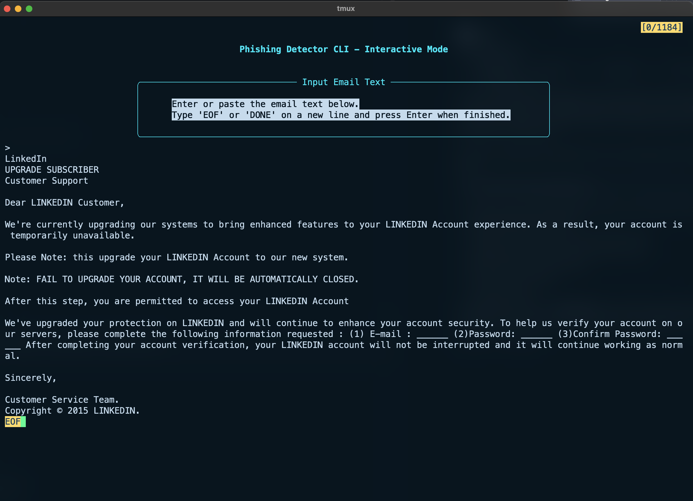
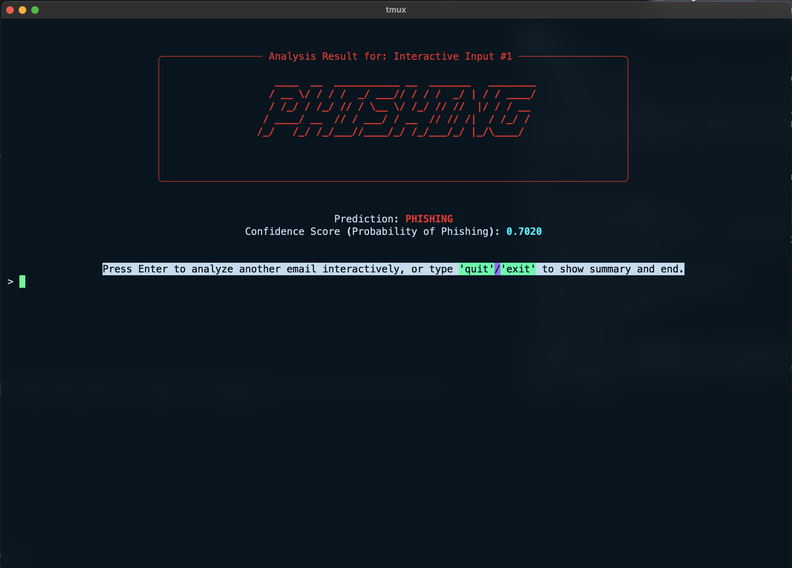

# Phishing Email Classifier

A machine learning-based CLI application that detects phishing emails using DistilBERT and LSTM neural networks.

## Features
- CLI interface with rich visual feedback
- Pre-trained model included
- Model taining sript included

## Prerequisites
- git
- Python 3
- pip
## Demo Video

[](https://www.youtube.com/watch?v=qNSeYnZ2q6Y)
https://youtu.be/qNSeYnZ2q6Y

## Installation
Clone this repository:
```bash
git clone
cd Phishing-Email-Classifier
```

### Automatically using setup.sh
This appraoch will install all the required dependencies and set up the virtual environment for you using python virtual environment.
1. Clone this repository (Already done if you are folled the previous steps)
2. Navigate to the project directory (Already done if you are folled the previous steps)
3. Make the `setup.sh` executable:
    ```bash
    chmod +x setup.sh
    ```
4. Run the setup script:
    ```bash
    ./setup.sh
    ```
5. Enter the virtual environment:
   ```bash
   source .venv/bin/activate  # On Windows use `.venv\Scripts\activate`
   ```
### Manually
1. Clone this repository
2. Navigate to the project directory
3. Get the ML model:
   ```bash
   git clone https://github.com/manyakaistha/Phishing_Classifier_ML_Model.git
   mv Phishing_Classifier_ML_Model trained_model
   ```
#### Using UV (recommended)

4. Create a virtual environment:
   ```bash
   uv venv
   ```
5. Activate the virtual environment:
   ```bash
   source .venv/bin/activate  # On Windows use `.venv\Scripts\activate`
   ```
6. Install the required dependencies:
   ```bash
   uv pip install -r requirements.txt
   ```
#### Using python virtual environment
4. Create a virtual environment:
   ```bash
   python -m venv .venv
   ```
5. Activate the virtual environment:
   ```bash
   source .venv/bin/activate  # On Windows use `.venv\Scripts\activate`
   ```
6. Install the required dependencies:
   ```bash
   pip install -r requirements.txt
   ```
#### Without virtual environment
4. Install the required dependencies:
   ```bash
   pip install -r requirements.txt
   ```
## Usage
```bash
python cli_app.py
```
Input the email text and one a new line write `EOF` or `DONE` and press `enter` to proceed to the prediction.




The result will be displayed in the terminal.


You can press `enter` to analyze another email or exit the app by typing `exit` or `quit` and then pressing `enter`.

## Training the Model (Optional)
If you want to retrain the model:
1. Navigate to the training_script directory
2. Run:
   ```bash
   python train_model.py
   ```

## Project Structure
- `cli_app.py`: Main CLI application
- `training_script/train_model.py`: Model training script
- `trained_model/`: Contains pre-trained model files
- `requirements.txt`: Python dependencies

## License
I don't any idea about the licensing, if you want to, fork it. Feel free to do so and use it for your own purposes. I take no responsibility for any misuse of this code.
